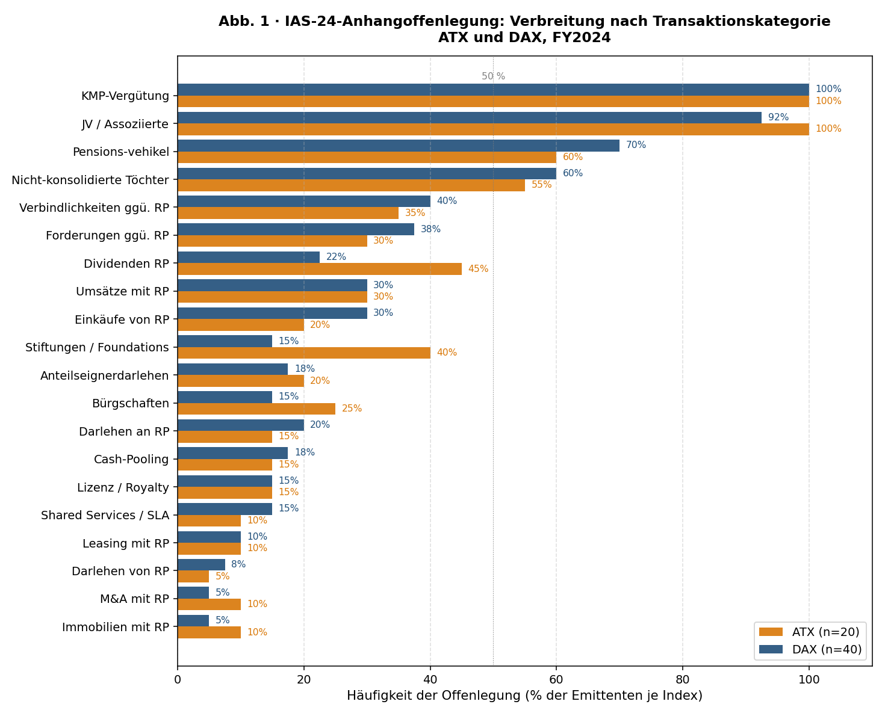
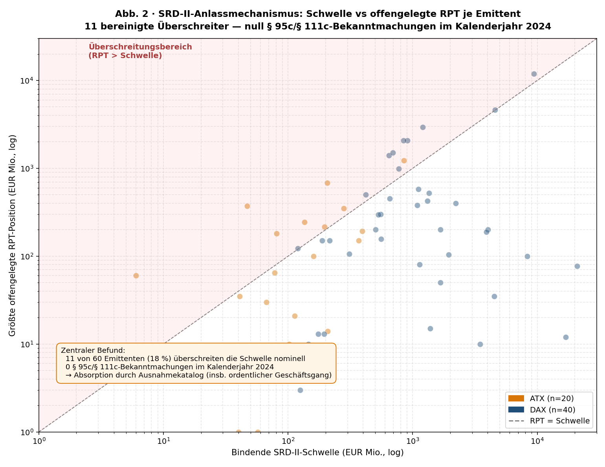

::: {custom-style="Abstract"}

**Auf den Punkt gebracht.** Die Transparenz von *Geschäften mit nahestehenden Personen* (Related Party Transactions, RPT) ruht in Österreich wie in Deutschland auf zwei Säulen: der *kontinuierlichen* Anhangoffenlegung nach IAS 24 als Bestandteil des Konzernabschlusses und dem *anlassbezogenen* Genehmigungs- und Veröffentlichungsregime nach §§ 95a–d AktG bzw §§ 111a–c dAktG (Umsetzung der zweiten Aktionärsrechte-Richtlinie). Eine vollständige Erhebung der FY2024-Konzernabschlüsse aller 20 ATX- und aller 40 DAX-Emittenten (n = 60) führt zu vier Befunden, die in dieser Verbindung im Schrifttum bislang nicht zusammengeführt wurden. *Erstens*: Säule 1 wird formal vollständig erfüllt — alle 60 Emittenten enthalten eine IAS-24-Anhangangabe und eine arm's-length-Aussage; die *Tiefe* dieser Angaben divergiert jedoch erheblich, mit Quantifizierungsraten unterhalb 40 % bei den klassischen Transaktionskategorien (Umsätze, Einkäufe, Forderungen, Verbindlichkeiten). *Zweitens*: Säule 2 ist im Berichtsjahr in der gesamten Population *wirkungslos* geblieben — kein einziger der 60 Emittenten hat 2024 eine Bekanntmachung nach § 95c bzw § 111c veröffentlicht. *Drittens*: die nominelle Schwellenwertasymmetrie zwischen Österreich (5 % Bilanzsumme oder 2,5 % Umsatz) und Deutschland (1,5 % AV+UV) ist auf der für die Anwendung relevanten *absoluten* Ebene umgekehrt — der Median des österreichischen Schwellenbetrags liegt rund neunmal *unter* dem deutschen. *Viertens*: 11 von 60 Emittenten überschreiten ihre bindende Schwelle numerisch; in zehn dieser elf Fälle absorbiert der Ausnahmekatalog (insbesondere "ordentlicher Geschäftsgang") die Veröffentlichungspflicht. *Folge*: Die operative Transparenzlast trägt allein Säule 1; der anlassbezogene Pfad bleibt in einem Berichtsjahr ohne aufsehenerregende Großtransaktion praktisch leer.

:::

# I. Die zwei Säulen der RPT-Transparenz

Die Berichterstattung über Geschäfte mit nahestehenden Personen ist in beiden hier untersuchten Rechtsordnungen auf zwei voneinander unabhängige Mechanismen verteilt. Die *erste Säule* ist die laufende Anhangoffenlegung nach **IAS 24** — verpflichtend für alle 60 untersuchten Emittenten, weil diese ihren Konzernabschluss nach IFRS-EU aufstellen (§ 245a UGB / § 315e dHGB). IAS 24 verlangt die Identifizierung sämtlicher nahestehender Beziehungen, die Angabe von Geschäften nach Art und Höhe (gegliedert nach Mutter, Tochter, Joint Venture, assoziierten Unternehmen, *key management personnel*, sonstigen nahestehenden Parteien), die Vergütung des Schlüsselpersonals in fünf Kategorien sowie die Angabe ausstehender Salden, Wertberichtigungen, Bürgschaften und sonstiger Konditionen. Die Säule ist *kontinuierlich*: Sie greift jedes Geschäftsjahr und unabhängig von Volumen- oder Wesentlichkeitsschwellen — die Angabepflicht entsteht bereits aus der *Beziehung*, nicht erst aus einem Geschäft.[^1]

Die *zweite Säule* ist das durch die zweite Aktionärsrechte-Richtlinie eingeführte **anlassbezogene Regime**: oberhalb einer normativ definierten Wesentlichkeitsschwelle löst ein konkretes Geschäft mit einer nahestehenden Person die Zustimmungspflicht des Aufsichtsrats (mit Stimmverbot betroffener RP-Mitglieder) sowie eine öffentliche Bekanntmachung auf der Internetseite des Emittenten aus.[^2] Die Säule wurde in Österreich durch das Aktienrechts-Änderungsgesetz 2019 (§§ 95a–d AktG, BGBl I 2019/63) und in Deutschland durch das ARUG II (§§ 111a–c dAktG, BGBl I 2019, 2637) umgesetzt. Sie ist *anlassbezogen* und *ereignisgetrieben*: kein wesentliches Geschäft → keine Anlassveröffentlichung.

Diese Zweisäuligkeit war im EU-Gesetzgebungsverfahren bewusst gewählt: IAS 24 sollte den Sockel der Transparenz tragen, SRD II die volumetrisch oder politisch *zugespitzten* Vorgänge auf eine zusätzliche Bekanntmachungsstufe heben. Die Architektur funktioniert nur dann, wenn beide Säulen tragen. Der vorliegende Beitrag prüft empirisch, ob das der Fall ist. Untersucht werden sämtliche FY2024-Konzernabschlüsse aller 20 ATX- und 40 DAX-Emittenten (n = 60). Erhoben werden für Säule 1 die Verbreitung der IAS-24-Disclosure-Kategorien, für Säule 2 die Bilanzsumme, die einschlägige Umsatzgröße, der größte quantifiziert offengelegte RPT-Einzelposten sowie die im Kalenderjahr 2024 nach § 95c bzw § 111c publizierten Bekanntmachungen.[^3]

# II. Säule 1: IAS 24 — die kontinuierliche Anhangoffenlegung

## 1. Normativer Gehalt

IAS 24.18 verlangt, dass der Konzernabschluss "Angaben über die Beziehungen zwischen einer Muttergesellschaft und ihren Tochterunternehmen" enthält, und zwar unabhängig davon, ob im Berichtsjahr Geschäfte vorgenommen wurden. Bei vorgenommenen Geschäften werden ergänzend die Art der Beziehung, die Höhe der Geschäfte, der Betrag der ausstehenden Salden inkl. Bedingungen und Sicherheiten, etwaige Wertberichtigungen und der Aufwand für uneinbringliche Forderungen angegeben. IAS 24.17 verlangt zusätzlich die Vergütung des Schlüsselpersonals nach fünf Kategorien (kurzfristige Leistungen, nachzubeschäftigungs­bezogene Leistungen, andere langfristige Leistungen, Leistungen aus Anlass der Beendigung des Arbeitsverhältnisses, anteilsbasierte Vergütung). IAS 24.23 erlaubt die Aussage, dass Geschäfte zu marktüblichen Konditionen erfolgten, *nur dann*, wenn dies "substantiated" — also belegt — werden kann.

## 2. Empirische Erfüllung — formal vollständig, in der Tiefe sehr heterogen

Die hier vollständig erhobene Population zeigt einen klaren Befund: **Säule 1 wird formal vollständig erfüllt**. Alle 60 Emittenten weisen eine IAS-24-Anhangangabe auf; alle 60 enthalten — wörtlich oder per Verweis auf den Vergütungsbericht (§ 78c AktG bzw § 162 dAktG) — die Vergütung des Schlüsselpersonals; alle 60 enthalten eine arm's-length-Aussage oder eine äquivalente "marktübliche Bedingungen"-Erklärung; 57 der 60 (95 %) nennen Joint Ventures und assoziierte Unternehmen ausdrücklich als nahestehend.

In der *Tiefe* der Angabe entstehen jedoch erhebliche Heterogenitäten (Abb. 1). Die obersten vier Kategorien — Schlüsselpersonalvergütung, JV/Assoziierte, Pensions­vehikel (insbesondere Pensionskassen und Pension-Trust-Strukturen) und nicht-konsolidierte Tochterunternehmen — werden universell oder nahezu universell adressiert. Die *klassischen Transaktionskategorien* — Umsätze und Einkäufe mit nahestehenden Personen, Forderungen und Verbindlichkeiten gegenüber nahestehenden Personen — werden hingegen nur von 27–38 % der Emittenten quantitativ ausgewiesen. Der Rest fasst die laufenden RP-Flüsse als "im Rahmen der gewöhnlichen Geschäftstätigkeit" oder "unwesentlich" zusammen, ohne quantitative Aufschlüsselung. Auch tiefer angesetzte Kategorien — Cash-Pooling, Lizenz-/Royalty-Strukturen, Shared-Services-Vereinbarungen, Bürgschaften, Leasing mit nahestehenden Personen — werden mit Verbreitungsquoten zwischen 10 % und 18 % nur sporadisch offengelegt.

Die Asymmetrie zwischen ATX und DAX (Abb. 1) verläuft entlang struktureller Linien des jeweiligen Aktionärsmilieus. Im ATX werden österreichische Privatstiftungen (40 % vs DAX 15 %) und Dividenden an kontrollierende Anteilseigner (45 % vs DAX 22 %) deutlich häufiger ausdrücklich genannt — Ausdruck der Dominanz der Privatstiftungen und der staatlichen Anteilseigner (ÖBAG, Republik Österreich) als Kernaktionäre im österreichischen Listing. Im DAX dominieren hingegen die strukturellen Konzern-Verflechtungs-Kategorien (Pensions­vehikel, JV-Geschäfte) stärker — Ausdruck der breiteren Konzern- und Trust-Strukturen in Deutschland.

## 3. Strukturelle Schwäche der ersten Säule

Die formale Vollständigkeit der ersten Säule darf nicht über ihre materielle Schwäche hinwegtäuschen. IAS 24.23 verlangt einen *Beleg* für die Marktüblichkeit; in der Praxis erschöpft sich die Aussage jedoch häufig in der formelhaften Wiederholung des Standardwortlauts ("at arm's length and in the ordinary course of business"). Die Norm enthält keine Verpflichtung zur Bezifferung sämtlicher Transaktionskategorien — sie verlangt nur die Angabe "der Höhe der Geschäfte", was Emittenten regelmäßig mit aggregierten Beträgen oder qualitativen Hinweisen erfüllen. IAS-24-Angaben können zudem per Verweis auf den Vergütungsbericht erfüllt werden, was die Lesbarkeit erschwert. Eine *Wirksamkeit* der Säule 1 setzt damit eine substantiierte Anwendung durch Vorstand, Prüfungsausschuss und Abschlussprüfer voraus, die das Recht zwar fordert, aber nicht durchsetzbar erzwingt.

# III. Säule 2: SRD II — das anlassbezogene Genehmigungs- und Veröffentlichungsregime

## 1. Normativer Gehalt

Die zweite Säule überlagert die erste in zwei Punkten. Erstens definiert sie eine *Wesentlichkeitsschwelle*: nur RPT, die diese Schwelle erreichen oder überschreiten, lösen das verstärkte Verfahren aus. Zweitens *individualisiert* sie die Reaktion auf solche Geschäfte: Statt einer pauschalen Anhangangabe im nächsten Jahresbericht wird das einzelne Geschäft als solches mit Bezeichnung, Wert und Beschreibung im konkreten Anlassdokument veröffentlicht.

**Schwellenformel.** Österreich verlangt nach § 95a AktG eine Wesentlichkeit von **5 % der Bilanzsumme *oder* 2,5 % der Umsatzerlöse** des Konzerns; die "*oder*"-Verknüpfung bedeutet, dass die *jeweils niedrigere* absolute Schwelle der beiden bindet.[^4] Deutschland verlangt nach § 111b Abs 1 dAktG **1,5 % der Summe aus Anlage- und Umlaufvermögen** nach § 266 Abs 2 lit A und B HGB — eine einzige Bezugsgröße. Geschäfte mit derselben nahestehenden Person sind innerhalb des laufenden Geschäftsjahres zu summieren (Aggregationsregel, SRD II Art 9c Abs 4). Bei Banken und Versicherungen wird der Begriff "Umsatzerlöse" in der österreichischen Praxis auf eine sektorgerechte Surrogatgröße erstreckt — bei Banken das Operating Income (Zinsergebnis + Provisionsergebnis + sonstige), bei Versicherungen die gebuchten Bruttoprämien.

**Rechtsfolgen.** Bei Erreichen der Schwelle lösen die Geschäfte (i) eine Zustimmungspflicht des Aufsichtsrats oder Prüfungsausschusses unter Ausschluss der betroffenen RP-Mitglieder (§ 95b AktG / § 111b Abs 2 dAktG) und (ii) eine *unverzügliche* Veröffentlichung auf der Internetseite des Emittenten aus (§ 95c AktG / § 111c dAktG). Beide Rechtsfolgen sind kumulativ, nicht alternativ.

**Ausnahmekatalog.** Die zweite Säule wird in beiden Rechtsordnungen durch einen umfangreichen Katalog an Ausnahmen und Tatbestandsausschlüssen wieder relativiert. Die wichtigsten — funktional parallel in Österreich und Deutschland — sind:

| Ausnahme / Ausschluss | Österreich | Deutschland |
|---|---|---|
| Geschäfte mit (voll-)konsolidierten Tochterunternehmen | § 95d Z 1 | § 111a Abs 3 Nr 1 |
| Ordentlicher Geschäftsgang zu marktüblichen Bedingungen | § 95d Z 2 | § 111a Abs 3 Nr 2 |
| Geschäfte, die einem Ausschüttungsanspruch aller Aktionäre entsprechen | § 95d | § 111a Abs 3 Nr 3 |
| Geschäfte in Bezug auf eigene Aktien | § 95d | § 111a Abs 3 Nr 4 |
| Vorstands- und Aufsichtsratsvergütungen | (Tatbestandsausschluss) | § 111a Abs 1 Satz 2 Nr 1 |

Der Katalog ist nicht abschließend; insbesondere "ordentlicher Geschäftsgang zu marktüblichen Bedingungen" hat in der Anwendungspraxis eine sehr breite Reichweite entwickelt, deren Konturen unten in V. quantifiziert werden.

## 2. Wieso der absolute Schwellenbetrag entscheidet

Vor dem empirischen Vergleich ist eine methodische Klärung notwendig: Die Schwellen sind im Gesetz *relativ* (in Prozent) formuliert; der Anwendungstest greift jedoch auf der *absoluten* Ebene (in EUR). Die Subsumtion eines konkreten Geschäfts ist nur in EUR-Beträgen leistbar — die Prozentregel ist der Bauplan, aus dem im Einzelfall ein EUR-Schwellenwert errechnet wird. Beispiel Verbund AG (FY2024): Bilanzsumme EUR 18.718 Mio., Umsatz EUR 8.225 Mio.; daraus 5 % BS = EUR 936 Mio., 2,5 % U = EUR 206 Mio.; die bindende absolute Schwelle ist EUR 206 Mio.

Aus dieser Überlegung folgt eine analytische Konsequenz, die den intuitiven rechtsvergleichenden Befund umkehrt: Eine reine Prozentdiskussion ("AT 5 % > DE 1,5 %") ist *tautologisch* und blendet die Heterogenität der Emittentengröße aus. Erst die Übersetzung in absolute Beträge offenbart, dass die bindende Schwelle bei CA Immobilien Anlagen bei EUR 6 Mio. liegt, bei der Deutschen Bank dagegen bei EUR 21 Mrd. — derselbe normative Tatbestand wirkt damit in der einen Konstellation als sehr scharfes, in der anderen als sehr weiches Filter.

## 3. Absolute Schwellenwerte in ATX und DAX

Aus den FY2024-Konzernabschlüssen lassen sich die bindenden absoluten Schwellen für alle 60 Emittenten berechnen. Die deskriptive Statistik (Tab. 1) zeigt einen Befund, der die intuitive Schwellenlesart geradezu umkehrt: der *Median des absoluten Schwellenbetrags* liegt im ATX bei EUR 108 Mio., im DAX bei EUR 1.000 Mio. — ein Faktor von 9,3×. Der arithmetische Mittelwert zeigt einen noch deutlicheren Abstand (Faktor 14,6×), wird allerdings von einigen DAX-Großbanken und -Versicherern (Allianz, Deutsche Bank, Volkswagen) verzerrt und ist daher rechtsvergleichend weniger aussagekräftig.

**Tab. 1 · Bindende SRD-II-Schwelle in EUR Mio., FY2024**

| Statistik | **ATX** (n = 20) | **DAX** (n = 40) |
|---|---:|---:|
| Minimum | 6 (CA Immo) | 82 (Qiagen)\* |
| 25-%-Quantil | 54 | 483 |
| **Median** | **108** | **1.000** |
| Mittelwert | 172 | 2.519 |
| 75-%-Quantil | 207 | 2.008 |
| Maximum | 850 (OMV) | 20.925 (Deutsche Bank) |
| Standardabweichung | 194 | 4.365 |

\* Qiagen ist niederländisch domiziliert und unterliegt der niederländischen SRD-II-Umsetzung (art 2:167 BW); 1,5 % der Bilanzsumme dient hier als Vergleichsproxy.

Die Ursachen sind zwei. *Erstens* der **reine Größeneffekt**: die ATX-Bilanzsummen liegen im Median bei rund EUR 9 Mrd., im DAX bei rund EUR 67 Mrd. — ein Faktor von 7,4×. *Zweitens* der **Formeleffekt** der österreichischen 2,5 %-Umsatzregel. Bei typischen Industrieemittenten (Bilanzsumme ≈ Umsatz) ist 2,5 % vom Umsatz mathematisch das Äquivalent einer 2,5 %-Bilanzregel — also strenger als die deutsche 1,5 %-Quote. Bei umsatzschwachen Emittenten (Immobilien, Banken, Versicherungen) bindet die Umsatzregel sogar deutlich strenger. CA Immo ist das extreme Beispiel: 2,5 % von EUR 239 Mio. Umsatzerlösen ergeben EUR 6 Mio., während 1,5 % der Bilanzsumme EUR 90 Mio. ergeben hätten. Die österreichische Norm bindet hier *fünfzehnfach* strenger als die deutsche.

Daraus folgt eine erste rechtsvergleichende Konsequenz: Die häufig im Schrifttum geäußerte Vermutung, der österreichische Gesetzgeber habe eine "großzügigere" Schwelle gewählt, hält der empirischen Realität nicht stand. Sie beruht auf einer ungeprüften Übertragung der relativen Prozente auf die absolute Ebene, ohne den Größenunterschied der Emittentengruppen zu berücksichtigen.

# IV. Welche Geschäfte überschreiten die Schwelle?

## 1. Tatbestandsabgrenzung

Vor der empirischen Frage "wer überschreitet?" ist eine Abgrenzung notwendig, die im Anwendungsdiskurs nicht immer klar getroffen wird. Folgende Vorgänge, die in den IAS-24-Anhangabschnitten auftauchen, fallen *nicht* unter den Tatbestand des § 95a AktG bzw § 111a dAktG:

- **Anteilige Dividenden an alle Aktionäre.** Die Dividende fließt dem kontrollierenden Gesellschafter qua Aktionärsstellung zu, nicht qua nahestehender Person. § 111a Abs 3 Nr 3 dAktG nennt sie ausdrücklich als ausgeschlossen — präziser formuliert: als außerhalb des Tatbestands. § 95d AktG enthält die parallele Ausschließung.
- **Beteiligungserträge aus Equity-Method-Anteilen.** Wenn die Emittentin als Anteilseignerin an einer assoziierten Gesellschaft Dividenden empfängt, ist dies ein passiver Investmentertrag; sie schließt mit der ausschüttenden Gesellschaft kein bilaterales "Geschäft" ab. Sie liegt mithin außerhalb des § 95a/§ 111a-Tatbestands.
- **Bestandsgrößen aus früheren Geschäftsabschlüssen.** § 95a AktG / § 111a dAktG knüpft an *abgeschlossene Geschäfte* an. Eine bilanzielle Forderung oder Verbindlichkeit, die aus einer in einem früheren Jahr abgeschlossenen Transaktion stammt (etwa Sale-and-Leaseback-Verbindlichkeiten aus 2023 oder konzerninterne Finanzverbindlichkeiten aus den 1980er Jahren), erfüllt im laufenden Berichtsjahr keinen neuen Tatbestand.
- **Vorstandsvergütungen** sind in beiden Rechtsordnungen ausdrücklich ausgenommen; ihre Transparenz wird durch den separat veröffentlichten Vergütungsbericht (§ 78c AktG / § 162 dAktG) gewährleistet.

Diese vier Fallgruppen sind aus dem empirischen Test ausgeklammert.[^5]

## 2. Die elf bereinigten Überschreiter

Nach Bereinigung um Pro-rata-Dividenden (vier Fälle: CA Immo, Verbund, Porsche SE, Erste Group), Beteiligungserträge (ein Fall: EVN) und Bestandsgrößen (zwei Fälle: Merck KGaA, Deutsche Telekom) verbleiben **elf Emittenten**, deren größter quantifiziert offengelegter RPT-Einzelposten den bindenden Schwellenwert numerisch überschreitet (Tab. 2 und Abb. 2). Einer dieser elf Fälle — PIERER Mobility — wird wegen der besonderen Konstellation einer im Berichtsjahr erfolgten Dekonsolidierung der KTM AG gesondert erörtert.

**Tab. 2 · Emittenten mit RPT-Einzelposten oberhalb der bindenden Schwelle (bereinigt, FY2024)**

| Rang | Emittent | Index | Größter RPT (EUR Mio.) | Schwelle (EUR Mio.) | Faktor | Einschlägige Ausnahme |
|---:|---|---|---:|---:|---:|---|
| 1 | Siemens Energy | DAX | 2.081 | 841 | 2,5× | keine — Bekanntmachung 12/2023 erfolgt |
| 2 | BASF | DAX | 2.943 | 1.206 | 2,4× | ordentlicher Geschäftsgang |
| 3 | Porsche AG | DAX | 2.062 | 908 | 2,3× | Konzernprivileg[^6] |
| 4 | Siemens Healthineers | DAX | 1.500 | 691 | 2,2× | Konzernprivileg[^6] |
| 5 | Telekom Austria | ATX | 243 | 135 | 1,8× | ordentlicher Geschäftsgang |
| 6 | OMV | ATX | 1.228 | 850 | 1,4× | ordentlicher Geschäftsgang |
| 7 | Volkswagen | DAX | 11.941 | 9.360 | 1,3× | ordentlicher Geschäftsgang |
| 8 | Infineon Technologies | DAX | 500 | 420 | 1,2× | ordentlicher Geschäftsgang |
| 9 | UNIQA Insurance Group | ATX | 215 | 196 | 1,1× | Konzernprivileg (vollkons. Tochter) |
| 10 | Zalando | DAX | 122 | 120 | 1,0× | ordentlicher Geschäftsgang |
| 11 | PIERER Mobility | ATX | 372 | 47 | 7,9× | offen — Sonderfall Dekonsolidierung |

Die quantitative Verteilung der einschlägigen Ausnahmegründe über die elf Fälle ist eindeutig: **sechs** Fälle (55 %) werden durch die Ausnahme "ordentlicher Geschäftsgang zu marktüblichen Bedingungen" abgedeckt; **drei** Fälle (27 %) durch das Konzernprivileg; in **einem** Fall (Siemens Energy) ist keiner der gesetzlichen Ausnahmetatbestände einschlägig, weshalb dieser Emittent tatsächlich eine § 111c-Bekanntmachung publiziert hat (allerdings im Dezember 2023, also vor dem hier betrachteten Kalenderjahr 2024); **PIERER Mobility** als elfter Fall bleibt rechtsdogmatisch offen.

## 3. Der Sonderfall PIERER Mobility

PIERER Mobility hat im November 2024 ihre Tochter KTM AG aus dem Konsolidierungskreis entlassen. Damit wurden die zuvor konzerninternen Forderungen — insbesondere eine Forderung der KTM AG gegen die PIERER New Mobility GmbH iHv rund EUR 372 Mio. — zu *interfremden* Forderungen, deren Gegenpartei nun als assoziiertes (nicht mehr konsolidiertes) Unternehmen einzustufen ist. Zwei Fragen, die in der bisherigen Kommentarliteratur soweit ersichtlich nicht ausgearbeitet worden sind, stellen sich:

- Ist die *Dekonsolidierung selbst* — der Akt, durch den die Forderung erstmalig als RP-Forderung qualifiziert wird — ein "Geschäft" iSd § 95a AktG? Dafür spricht, dass die zugrundeliegende Anteilsveränderung eine eigenständige Transaktion ist; dagegen, dass die Forderung selbst nicht neu abgeschlossen wurde.
- Falls ja: greift das Konzernprivileg auf Geschäfte, durch die *gerade* die Tochtereigenschaft endet?

In den von uns recherchierten EQS-Newsfeeds und IR-Mitteilungen von PIERER Mobility wurde im Kalenderjahr 2024 keine Bekanntmachung nach § 95c AktG publiziert. Die Bewertung der Dekonsolidierung *sub specie* § 95a AktG bleibt damit offen und ist aus Sicht des Verfassers eine de-lege-ferenda-relevante Frage für vergleichbare Carve-out-Konstellationen.

## 4. Eine wichtige Einschränkung der Klassifikation

Die in Tab. 2 ausgewiesenen Ausnahmen — insbesondere "ordentlicher Geschäftsgang" — sind *Emittentenklassifikationen*, nicht objektiv-rechtlich überprüfte Befunde. Bei den sechs einschlägigen Fällen handelt es sich um ökonomisch hochwesentliche Vorgänge mit Volumina im einstelligen bis zweistelligen Milliarden-EUR-Bereich (BASF: mehrjährige PPA-Rahmenverträge mit JV-Partnern; Telekom Austria: Master-Lease mit EuroTeleSites; OMV: ECA-Bürgschaft für Borouge 4; Volkswagen: Darlehen an die chinesischen JVs FAW/SAIC/JAC; Infineon: mehrjährige Kapitaltranchen für das ESMC-JV in Dresden; Zalando: laufende Wareneinkäufe von Bestseller-kontrollierten Marken). Sie werden vom jeweiligen Emittenten — gestützt auf eine Bewertung durch Prüfungsausschuss und Abschlussprüfer — der Ausnahme zugeordnet. Eine gerichtliche Bestätigung der Reichweite dieser Ausnahme über mehrjährige Rahmenverträge mit JV-Partnern in Milliardenhöhe existiert in keiner der beiden Rechtsordnungen.

# V. Säule 2 im Test: Null Bekanntmachungen 2024

Die zentrale empirische Beobachtung des FY2024-Datensatzes ist nicht die Zahl der nominellen Überschreitungen, sondern die Zahl der *tatsächlich publizierten Bekanntmachungen*. Eine systematische Abfrage der IR-Seiten aller 60 Emittenten, ergänzt durch die EQS-, DGAP-, Wiener-Börse- und OeKB-Newsfeeds sowie den Bundesanzeiger über das volle Kalenderjahr 2024, ergibt ein eindeutiges Ergebnis: **Kein einziger der 60 Emittenten hat im Kalenderjahr 2024 eine Bekanntmachung nach § 95c AktG oder § 111c dAktG publiziert**. Die einzige zeitlich naheliegende Bekanntmachung — die Veräußerung der 18-%-Beteiligung an Siemens Limited (Indien) durch Siemens Energy AG an Siemens AG für EUR 2.081 Mio. — datiert vom 8. Dezember 2023 und fällt damit außerhalb des untersuchten Kalenderjahres.

Die Diskrepanz zwischen elf nominellen Schwellenüberschreitungen und null tatsächlichen Bekanntmachungen ist die zentrale Pointe der Untersuchung. Sie ist nicht ein Hinweis darauf, dass das Recht *missachtet* würde — der Befund ist mit dem jeweiligen Ausnahmekatalog vollständig konsistent. Sie ist vielmehr ein Hinweis darauf, dass die normative Architektur so angelegt ist, dass die *materiell* bedeutendsten Kategorien von RPT — Konzernfinanzierung, ordentlicher Bezug von Vorleistungen, JV-Bürgschaften — systematisch außerhalb des anlassbezogenen Veröffentlichungsregimes verbleiben. Säule 2 ist im Berichtsjahr in der gesamten ATX-/DAX-Population *wirkungslos* geblieben.

# VI. Synthese: Wo trägt welche Säule?

Die zentrale Erkenntnis aus der Verbindung der beiden Säulen ist eine *Lastenverteilung*: Die *operative* Transparenz aller materiell bedeutsamen RPT in der ATX-/DAX-Population wird *ausschließlich* von Säule 1 (IAS 24) getragen. Säule 2 (SRD II) liefert im untersuchten Berichtsjahr keinen empirisch nachweisbaren Mehrwert. Diese Aussage ist *empirisch* — sie spricht über das, was im Jahr 2024 passiert ist —, nicht *normativ* — sie sagt nicht, dass Säule 2 keine Rolle spielen *könnte*. Sie sagt jedoch, dass im Regelfall des Berichtsjahres die *abschreckende Wirkung* eines Genehmigungs- und Veröffentlichungsregimes nur dann zum Tragen kommt, wenn ein Vorgang den Ausnahmekatalog tatsächlich durchbricht — und dass solche Vorgänge in der untersuchten Population *vernachlässigbar selten* sind.

Daraus folgen drei Beobachtungen über die Architektur:

- **Komplementarität ist gewünscht, aber asymmetrisch wirksam.** Säule 1 und Säule 2 sind in der EU-Konzeption komplementär gedacht: laufende Transparenz plus *zusätzliche* Anlasstransparenz für die volumetrisch wesentlichen Vorgänge. Die empirische Asymmetrie — Säule 1 trägt allein, Säule 2 schweigt — ist nicht in der Norm angelegt, sondern Resultat der breiten Ausnahmen.

- **Säule 2 ist kein scharfes Schwert, sondern ein Notfall-Trigger.** Die Architektur funktioniert wie eine "kalte Reserve": Sie ist da, wenn ein Vorgang das Ausnahmenetz durchbricht (Siemens-Energy-Indien-Transaktion 2023). Aber im normalen Geschäftsverlauf — Konzernfinanzierung, JV-Beziehungen, ordentlicher Bezug — wird sie nicht aktiv.

- **Säule 1 ist damit faktisch die einzige operative Säule.** Sie muss daher die Substanz der RPT-Transparenz tragen. Wenn IAS 24 — wie hier dokumentiert — bei Quantifizierungsraten unter 40 % stagniert, dann läuft die Architektur insgesamt *unterkalibriert*.

## Die Konsequenz für die Praxis

Da Säule 2 im Regelfall nicht zündet, hängt die tatsächliche RPT-Transparenz an der Substanz der IAS-24-Anhangangabe. Vorstand, Prüfungsausschuss und Abschlussprüfer haben damit eine erhöhte Pflicht zur substantiellen Anwendung des IAS-24-Standards — nicht zur formellen, sondern zur quantitativen, kategorienscharfen und belegten Offenlegung. In der hier untersuchten Population erfüllen nur wenige Emittenten (insbesondere Volkswagen, Porsche AG, Siemens Energy, BASF, Beiersdorf, Wienerberger) diesen erhöhten Anspruch konsequent.

# VII. Governance-Dimension

Eine Frage, die durch den dokumentierten Null-Befund an Bedeutung gewinnt, betrifft die Governance des Genehmigungsvorbehalts. Sowohl § 95b AktG als auch § 111b Abs 2 dAktG übertragen die Zustimmung dem Aufsichtsrat — gerade in jenen Konstellationen, in denen der Aufsichtsrat mit Vertretern der nahestehenden Person besetzt ist. Das Stimmverbot für betroffene RP-Mitglieder ist die einzige verfahrensrechtliche Schutzeinrichtung gegen die strukturelle Konfliktsituation; seine Wirksamkeit hängt von der Mehrheit der nicht-RP-Mitglieder im jeweiligen Prüfungsausschuss ab. In der ATX-Population sind die Vertretungen der nahestehenden Person im Aufsichtsrat in einer Reihe von Konstellationen signifikant: voestalpine (Kernaktionärssyndikat), Verbund (Republik Österreich + Landesbeteiligungen), Erste Group (ERSTE-Stiftung), Wienerberger (ANC Privatstiftung), CA Immo (Starwood). Im DAX gilt Vergleichbares für Henkel (Familienpool), Beiersdorf (maxingvest), Merck KGaA (E.-Merck-KG-Familienpool), Porsche AG (VW als Mehrheitsaktionär), Volkswagen (Porsche/Piëch-Familie via Porsche SE; Land Niedersachsen). Eine systematische Erhebung der Anteile der nicht-RP-Mitglieder im jeweiligen Prüfungsausschuss würde den Rahmen dieses Beitrags sprengen; sie wäre ein ergiebiges Folgethema.

# VIII. Diskussion und Schlussfolgerungen

1. **Die zweisäulige Transparenzarchitektur ist im FY2024 strukturell unausgeglichen.** Säule 1 (IAS 24) wird formal erfüllt, materiell jedoch in der Tiefe schwach umgesetzt; Säule 2 (SRD II) trägt im untersuchten Jahr nicht. Die Last der operativen Transparenz fällt damit allein auf Säule 1.

2. **Die nominelle Schwellenwertasymmetrie zwischen Österreich und Deutschland ist empirisch umgekehrt.** Auf der relativen Ebene ist die österreichische Quote (5 % BS oder 2,5 % U) deutlich höher als die deutsche (1,5 % AV+UV). Auf der absoluten Ebene — der einzig anwendungsrelevanten — liegt der Median des österreichischen Schwellenbetrags um Faktor 9,3 *unter* dem deutschen. Die Vermutung, der österreichische Gesetzgeber habe eine "großzügigere" Schwelle gewählt, hält der empirischen Realität nicht stand.

3. **Die SRD-II-Anlassbekanntmachung ist im FY2024 wirkungslos geblieben.** Null Bekanntmachungen in 60 großen Emittenten über zwölf Monate sind ein robustes empirisches Signal — kein Indiz für Normverstöße, sondern für die strukturelle Wirkung des Ausnahmekatalogs.

4. **Die Wirkung der Ausnahmen konzentriert sich auf zwei Tatbestände.** Sechs der elf bereinigten Überschreitungsfälle (55 %) fallen unter "ordentlicher Geschäftsgang zu marktüblichen Bedingungen", drei weitere (27 %) unter das Konzernprivileg. Damit absorbieren diese beiden Ausnahmegründe gemeinsam 82 % der bereinigten Überschreiter. Ihre Reichweite ist *de facto* die entscheidende Variable des Regimes — nicht die Schwellenhöhe.

5. **Die "ordentlicher Geschäftsgang"-Ausnahme ist konzeptionell nicht ausreichend konturiert.** Sie wird gegenwärtig auf mehrjährige Rahmenverträge mit JV-Partnern, Konzern-Cash-Pools und Bürgschaften in Milliardenvolumen angewandt. Eine *de lege ferenda*-Diskussion über eine engere Konturierung — etwa durch ergänzende Schwellenwerte für mehrjährige Rahmenverträge, Verrechnungspreis-Dokumentationspflichten oder eine quantifizierte Beschränkung auf Vorgänge, deren Einzelwert unter der Schwelle liegt — wäre angezeigt.

6. **Säule 1 hat Vorrang vor Säule 2, nicht umgekehrt.** Der Beitrag macht das tradierte Hierarchieverständnis ("Säule 2 ist die strenge zusätzliche Stufe") empirisch fragwürdig: In der Anwendung ist Säule 2 ohne erkennbare Wirkung. Substanz und Qualität der RPT-Transparenz hängen daher an Säule 1 — an der substantiellen Anwendung des IAS-24-Standards durch Vorstand, Prüfungsausschuss und Abschlussprüfer.

7. **Aus Sicht der Konzernabschluss-Disclosure ist der Befund von praktischer Bedeutung.** Emittenten sind gut beraten, die Schwellenwerte je Berichtsperiode *explizit* zu berechnen und die Anwendung der Ausnahmegründe in der Anhangangabe ausdrücklich zu benennen — eine Praxis, die in den FY2024-Berichten erst bei wenigen Emittenten konsequent geübt wird.

# IX. Praktische Empfehlungen

Vor Verabschiedung des nächsten Konzernabschlusses sollten Vorstand, Prüfungsausschuss und Abschlussprüfer:

1. die bindende SRD-II-Schwelle in EUR-Beträgen explizit berechnen und schriftlich dokumentieren — für österreichische Emittenten unter ausdrücklicher Ausweisung der niedrigeren der beiden Werte aus 5 % Bilanzsumme und 2,5 % Konzernumsatz;

2. sämtliche RPT-Einzelposten oberhalb der bindenden Schwelle in einer eigenen Liste erfassen und gegen die Ausnahmekataloge des § 95d AktG bzw § 111a Abs 3 dAktG abgleichen;

3. die jeweils einschlägige Ausnahme in der Anhangangabe *namentlich* benennen — die bloße Erwähnung der Schwelle ohne explizite Subsumtion lässt offen, ob das Genehmigungs- und Veröffentlichungsverfahren tatsächlich geprüft wurde;

4. bei Berufung auf den ordentlichen Geschäftsgang konkrete Belege für die Marktüblichkeit beibringen (Verrechnungspreis-Methodik, externe Benchmark-Vergleiche, Audit-Ausschuss-Protokolle), statt sich auf pauschale Formulierungen ("at arm's length") zu beschränken;

5. die IAS-24-Anhangangabe substantiell — und nicht nur formal — gestalten; insbesondere die quantitativen Kategorien (Umsätze, Einkäufe, Forderungen, Verbindlichkeiten, Bürgschaften) je nahestehende Person bzw je Gruppe nahestehender Personen einzeln beziffern;

6. die Governance-Architektur des Prüfungsausschusses regelmäßig auf die Mehrheit der nicht-RP-Mitglieder überprüfen, insbesondere in Konstellationen mit signifikantem Mehrheits- oder Kernaktionärseinfluss im Aufsichtsrat;

7. bei Carve-out- und Dekonsolidierungsvorgängen die Frage explizit prüfen, ob der Vorgang selbst — und nicht erst die nachfolgenden RPT mit dem nun dekonsolidierten Unternehmen — eine § 95c-/§ 111c-Bekanntmachungspflicht auslöst.

---

**Datengrundlage.** Die Datenmatrix für alle 60 Emittenten (Bilanzsumme, Umsatz, absolute Schwelle, größter RPT-Einzelposten, einschlägige Ausnahme, Anzahl 2024-Bekanntmachungen) sowie die per-Emittent-Auszüge der IAS-24-Anhangabschnitte sind im Forschungsrepository einsehbar; die Klassifikationssyntax und die Häufigkeitsmatrix der zwanzig Disclosure-Kategorien folgen einem nach IAS 24.18 strukturierten Kategorienkatalog.

---

[^1]: IAS 24 (Related Party Disclosures), in der von der EU-Kommission per VO (EU) 2023/1803 endorsement-gefassten Fassung; Anhang-Pflichten insbesondere IAS 24.13 (Identifizierung), .17 (KMP-Vergütung in fünf Kategorien), .18 (Geschäftsangaben), .23 (Belegpflicht für Marktüblichkeit).

[^2]: Richtlinie (EU) 2017/828 des Europäischen Parlaments und des Rates vom 17.5.2017 zur Änderung der RL 2007/36/EG im Hinblick auf die Förderung der langfristigen Mitwirkung der Aktionäre, ABl L 132/1, Art 9c (Geschäfte mit nahestehenden Unternehmen und Personen).

[^3]: Methodik: Die Datenerhebung erfolgte über die offiziellen FY2024-Konzernabschlüsse (PDF-Originale) sämtlicher 60 Emittenten, ergänzt durch die jeweiligen Vergütungsberichte, EQS-/DGAP-/Wiener-Börse-/OeKB-Newsfeeds für das Kalenderjahr 2024 sowie den Bundesanzeiger. Die per-Emittent-Auszüge sind im begleitenden Repository einsehbar.

[^4]: § 95a AktG idF AktRÄG 2019; die exakte Verortung der Schwellenwerte (Abs 1 Z 2 oder Abs 2) ist gegenüber dem Wortlaut der konsolidierten Fassung zu prüfen. § 111b Abs 1 Satz 1 dAktG idF ARUG II.

[^5]: Die hier praktizierte Bereinigung wirkt strenger als der bloße Tatbestandsausschluss nahelegt: Pro-rata-Dividenden, Beteiligungserträge aus Equity-Method-Anteilen, Altbestände und Vorstandsvergütungen werden vollständig aus dem empirischen Test ausgeschlossen. Im Ergebnis reduziert sich die Zahl der nominellen Überschreitungen von 18 (Rohdaten) auf 11 (bereinigt, einschließlich PIERER Mobility als Sonderfall).

[^6]: Die Anwendung des Konzernprivilegs (§ 95d Z 1 AktG bzw § 111a Abs 3 Nr 1 dAktG) auf Geschäfte mit dem *Mutterunternehmen* ist nicht unstreitig. § 111a Abs 3 Nr 1 dAktG erfasst nach Wortlaut "Geschäfte mit Tochterunternehmen". Eine strikt-textliche Auslegung würde Konzern-Cash-Pools und Konzern-Treasury-Strukturen, in denen die börsenotierte Gesellschaft Schuldnerin ihrer eigenen Mutter ist, nicht erfassen; sie müssten dann auf die Ausnahme "ordentlicher Geschäftsgang" gestützt werden. Die in Lehre und Praxis vorherrschende teleologische Lesart erfasst beide Richtungen — das *Konzern*verhältnis steht im Vordergrund, nicht die Richtung des Leistungsflusses. Die in Tab. 2 verwendete Klassifikation folgt der teleologischen Lesart.
